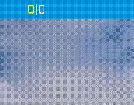
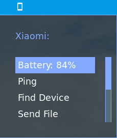

# polybar-kdeconnect

[KDEConnect](https://github.com/KDE/kdeconnect-kde) module for [Polybar](https://github.com/jaagr/polybar)




  
Demo with [Material Theme](https://github.com/DaveDavenport/rofi-themes/blob/master/User%20Themes/material.rasi) and [Material Polybar](https://github.com/adi1090x/polybar-themes)

## Dependencies
* [rofi](https://github.com/DaveDavenport/rofi)
* [kdeconnect](https://github.com/KDE/kdeconnect-kde)
* Iosevka Nerd Font
* [Zenity](https://github.com/GNOME/zenity)
* qbus-qt5 (or qt5tools on some distros)

## Usage
Place the given script in some folder, and use it in your polybar `config` as
```  
[module/kdeconnect]  
type = custom/script  
exec = "/path/to/files/polybar-kdeconnect.sh -d"  
tail = true
````

## Customization
You can change the variables in [`polybar-kdeconnect.sh`](polybar-kdeconnect.sh) to customize the [rofi](https://github.com/DaveDavenport/rofi) menu and the icons shown in [polybar](https://github.com/jaagr/polybar)

## Default Color Code Legend
Color | Meaning |
---|---|
 | Device Disconnected |
 | Unpaired Device |
 | Battery >= 90 |
 | Battery >= 80 |
 | Battery >= 70 |
 | Battery >= 60 |
 | Battery >= 50 |
 | Battery < 50 |


## Changelog
### v2
* Supports Multiple Devices without extra configuration
* Supports pairing/unpairing devices
* Removed `kdeconnect-cli` as dependency
* Combined seperate files into one
* Seperate icons for tablets and smartphone
